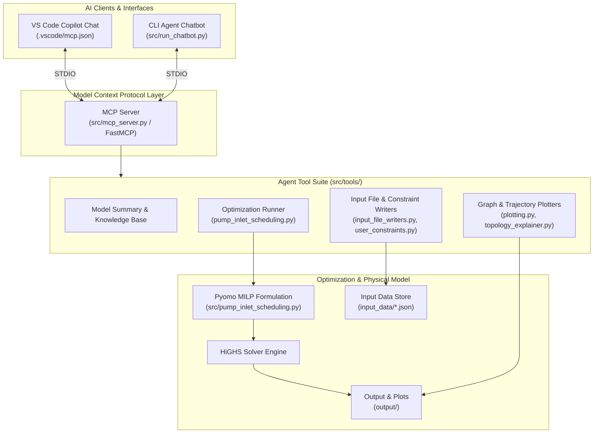
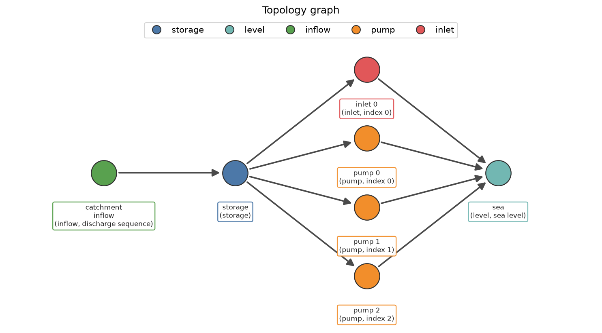
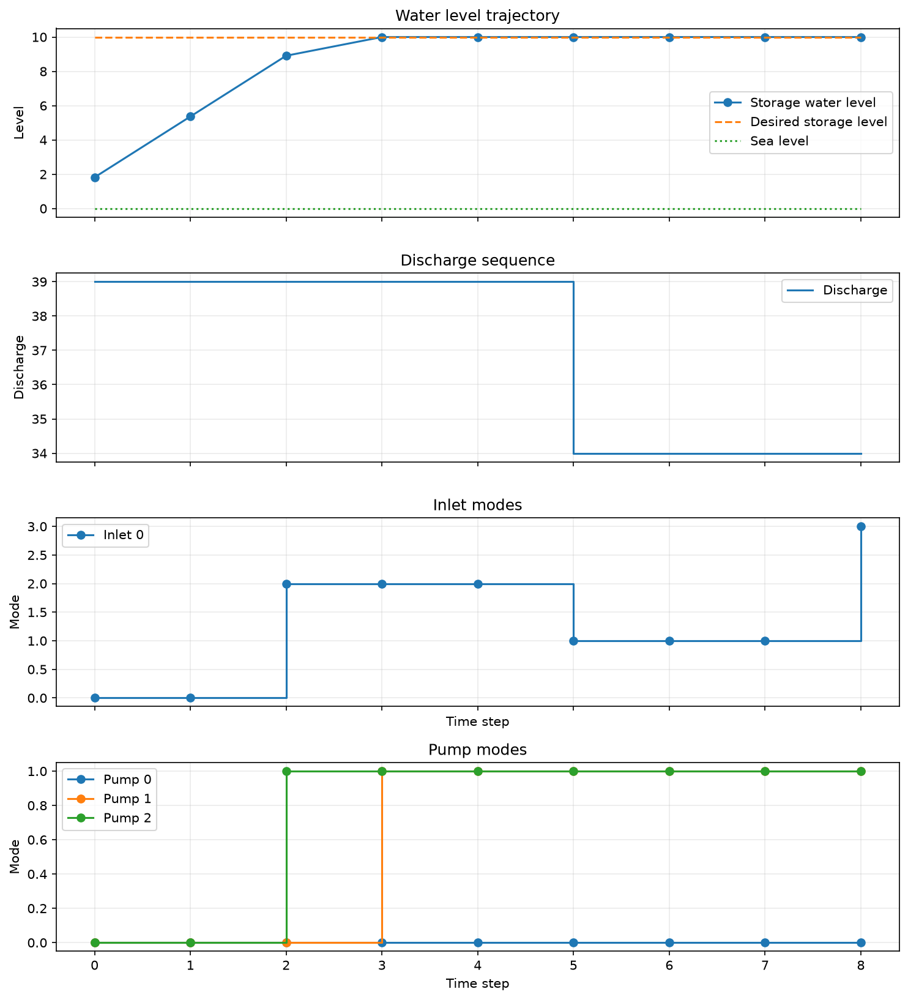

# HydroAgent: AI-Powered Mathematical Optimization & Scheduling

[](https://www.python.org/)
[](https://modelcontextprotocol.io/)
[](https://www.pyomo.org/)
[](https://code.visualstudio.com/)

HydroAgent is an autonomous AI agent framework that bridges **Large Language Models (LLMs)** with Mixed-Integer Linear Programming (**MILP**) to inspect, modify, optimize, and visualize complex physical systems. It demonstrates how an AI agent can assist across various phases of scheduling problems, including model construction, execution, result visualization, and interactive user collaboration.

Built using the **Model Context Protocol (MCP)**, the **OpenAI Agents SDK**, and **Pyomo**, this system turns natural language instructions into mathematically rigorous, constraint-satisfying schedules for hydraulic infrastructure (pumps, inlets, reservoirs, and level bodies).

---

## Key Highlights & AI Capabilities

- **Model Context Protocol (MCP) Integration**: Features a full-featured MCP Server ([src/mcp_server.py](src/mcp_server.py)) built with `FastMCP` that exposes more than 18 domain-specific tools for system inspection, topology editing, MILP solving, and plot generation.
- **AI Interface**:
  - **VS Code GitHub Copilot Extension**: Configured via [.vscode/mcp.json](.vscode/mcp.json) and customized with domain instructions in [.github/copilot-instructions.md](.github/copilot-instructions.md).
  - **CLI Agent**: Interactive terminal chatbot ([src/run_chatbot.py](src/run_chatbot.py)) built on the **OpenAI Agents SDK** (`agents-sdk`) over `MCPServerStdio`.
- **Domain-Grounded Guardrails**: Incorporates a structured knowledge base ([knowledge_base/](knowledge_base/)) and agent safeguards (e.g., zero-based index verification, multi-file consistency checks, explicit confirmation before state mutation).
- **State-of-the-Art Planning Core**: Formulates discrete mode switching, minimum run duration, hydraulic head restrictions, and water storage balances into a Pyomo MILP model solved via HiGHS.

---

## System Architecture



---

## Interaction Examples

Here is how the AI agent interprets user intent, calls tools over MCP, verifies constraints, and executes complex physical optimization workflows:

### 1. Visualizing System Topology
Ask the agent to generate and explain the physical network graph.

> **User:** *"Show me a picture of the current system topology and explain how the components are connected."*

```text
Assistant:
I will generate a directed graph plot of the active topology and provide an explanation.

[Executed Tool: plot_topology_graph()]
[Executed Tool: create_topology_explanation()]

Topology Explanation:
• Storage Basin ('storage'): Receives inflow from 'catchment_inflow'.
• Outflows: 3 Pumps ('pump_0', 'pump_1', 'pump_2') and 1 Inlet ('inlet_0') discharge water into the 'sea'.
• Hydraulic Head Rule: 'inlet_0' can only open when the storage water level is higher than the sea level.
```



---

### 2. Modifying Physical System Elements
Instruct the agent to modify pump or inlet specifications in natural language.

> **User:** *"I want to add a 4th pump (pump 3) with a max capacity of 15 m³/s and minimum duration of 4 periods."*

```text
Assistant:
Before updating the model parameters, let me summarize the proposed changes for confirmation:
1. pumps.json:
   - Add column for Pump 3 (index 3).
   - Mode 0 flow: 0 m³/s, Mode 1 flow: 15 m³/s.
   - Minimum mode duration: 4 time steps for all modes.
2. topology.json:
   - Add element 'pump_3' (type: pump, index: 3, upstream: 'storage', downstream: 'sea').
   - Add connection from 'storage' to 'sea' via 'pump_3'.
   - Add 'pump_3' to 'storage_balance.outflows'.

Should I proceed with updating input_data/pumps.json and input_data/topology.json?
```

> **User:** *"Yes, go ahead."*

```text
[Executed Tool: create_pumps_json(...)]
[Executed Tool: create_topology_json(...)]

Assistant:
Updated input_data/pumps.json and input_data/topology.json successfully.
```

---

### 3. Adding Schedule & Operational Constraints
Force specific operational rules at specific time windows.

> **User:** *"Force pump 1 to be in mode 2 at time step 7, and keep inlet 0 closed at time step 5."*

```text
Assistant:
I will update user_constraints.json with the following fixed mode schedules:
• Pump 1 (index 1) -> Mode 2 at time step 7
• Inlet 0 (index 0) -> Mode 0 (closed) at time step 5

[Executed Tool: create_user_constraints(...)]

Assistant:
Successfully updated input_data/user_constraints.json. Would you like me to run the optimization model now?
```

---

### 4. Running Optimization & Visualizing Results
Solve the scheduling MILP model and display the trajectories.

> **User:** *"Run the optimizer and show me the water level trajectory and pump schedule overview."*

```text
Assistant:
Running the Pyomo MILP optimization engine with the HiGHS solver...

[Executed Tool: run_optimization()]
[Executed Tool: plot_results_overview()]

Optimization Results:
• Status: Optimal solution found.
• Objective: Storage water level strictly maintained within safety bounds [5.0m, 200.0m].
• Results written to output/results.txt.
```



---

## Scheduling & Optimization Formulation

The core backend ([src/pump_inlet_scheduling.py](src/pump_inlet_scheduling.py)) models the hydraulic system as a **Mixed-Integer Linear Program (MILP)** using **Pyomo AML**:

1. **Storage Volume Balance**:
   $$V[t+1] = V[t] + \Delta t \left( Q_{\text{inflow}}[t] - \sum_{p} Q_{\text{pump}, p}[t] - \sum_{i} Q_{\text{inlet}, i}[t] \right)$$
2. **Water Level Relationship**:
   $$H[t] = \frac{V[t]}{\text{Area}}$$
3. **Discrete Mode Choice**:
   Each pump $p$ and inlet $i$ selects exactly one operating mode $m \in M$ at each time step $t$:
   $$\sum_{m} y_{p, m}[t] = 1$$
4. **Minimum Mode Duration**:
   Prevents rapid cycling by requiring device $p$ to stay in mode $m$ for at least $D_{p, m}$ time steps after switching:
   $$\sum_{\tau = t}^{t + D_{p, m} - 1} y_{p, m}[\tau] \ge D_{p, m} \left( y_{p, m}[t] - y_{p, m}[t-1] \right)$$
5. **Disjunctive Hydraulic Head Constraints**:
   Inlets can operate in non-closed modes ($m \neq 0$) **only** if upstream storage level exceeds downstream sea level ($H_{\text{storage}}[t] \ge H_{\text{sea}}[t] + \epsilon$).

---

## MCP Tool Reference

The MCP Server ([src/mcp_server.py](src/mcp_server.py)) exposes the following tools to Copilot and Agent clients:

| Category | MCP Tool Name | Description |
| :--- | :--- | :--- |
| **Inspection** | `get_current_model_summary` | Reads and returns all active JSON configuration files. |
| | `create_topology_explanation` | Generates a plain-language structural summary of the system. |
| **Model Writers** | `create_pumps_json` | Sets pump flow rates, minimum durations, and freeze states. |
| | `create_inlets_json` | Sets inlet flow rates, closed mode, and freeze states. |
| | `create_storage_json` | Sets storage area, volume limits, and initial volume. |
| | `create_topology_json` | Sets graph elements, connections, and balance/head equations. |
| | `create_user_constraints` | Adds fixed pump/inlet mode constraints at specific time steps. |
| **Optimization** | `run_optimization` | Solves the Pyomo MILP model via HiGHS and writes `output/results.txt`. |
| **Data Reading** | `read_water_level_trajectory` | Parses optimized storage levels from solution files. |
| | `read_pump_modes` / `read_inlet_modes` | Extracts operating schedules per device over time. |
| | `read_sea_level` / `read_discharge_sequence` | Reads horizon time series inputs. |
| **Visualization** | `plot_topology_graph` | Generates directed graph plot of system topology. |
| | `plot_water_level_trajectory` | Plots storage water level against targets and sea level. |
| | `plot_results_overview` | Generates a multi-panel summary (levels, series, pump & inlet modes). |
| | `open_plot_file` | Opens generated PNG plot in default OS viewer. |

---

## Getting Started

### Prerequisites
- Python 3.10+

### Installation
Clone the repository and install the dependencies:

```powershell
git clone https://github.com/FaridAlavi/HydroAgent.git
cd HydroAgent

python -m venv .venv
.\.venv\Scripts\Activate.ps1
pip install -r requirements.txt
```

---

### Running Options

#### Option A: Inside VS Code with GitHub Copilot (Recommended)
1. Open this workspace in VS Code.
2. Ensure [.vscode/mcp.json](.vscode/mcp.json) is present.
3. Open **Copilot Chat** (`Ctrl+Alt+I`).
4. Ask Copilot directly: *"Can you show me the system topology and run the optimization?"*

#### Option B: Standalone CLI Chatbot (OpenAI Agents SDK)
Set your OpenAI API key and start the interactive terminal agent:

```powershell
$env:OPENAI_API_KEY = "sk-..."
python src/run_chatbot.py
```

#### Option C: Direct Python Optimization Script
Solve the optimization problem directly via script:

```powershell
python src/pump_inlet_scheduling.py
```

---

## 📁 Repository Structure

```text
├── input_data/                  # Active scenario configuration files
│   ├── horizon.json             # Time horizon & input series (discharge, sea level)
│   ├── inlets.json              # Inlet modes & flow rates
│   ├── pumps.json               # Pump modes, flows & min durations
│   ├── storage.json             # Storage area & volume bounds
│   ├── topology.json            # Graph elements & equation definitions
│   └── user_constraints.json    # Fixed user mode schedule constraints
├── knowledge_base/              # Domain knowledge base for AI agent guidance
│   ├── elements/                # Rules for inflow, inlet, level, pump, storage
│   ├── input_files.md           # File specification rules
│   └── topology.md              # Network topology rules
├── output/                      # Optimization outputs & generated plots
│   ├── plots/                   # Generated PNG diagrams & trajectories
│   └── results.txt              # Optimization output schedule
├── src/                         # Application source code
│   ├── __init__.py
│   ├── mcp_server.py            # FastMCP server implementation (18+ tools)
│   ├── pump_inlet_scheduling.py # Pyomo MILP optimization formulation & HiGHS solver
│   ├── run_chatbot.py           # CLI MCP Chatbot using OpenAI Agents SDK
│   └── tools/                   # Modular agent tool suite
│       ├── __init__.py
│       ├── input_file_writers.py # Scenario JSON model generation tools
│       ├── plotting.py          # Matplotlib visualization suite
│       ├── topology_explainer.py # Plain-language network topology generator
│       └── user_constraints.py  # Helper for user schedule constraint generation
├── .github/
│   └── copilot-instructions.md  # System prompt & domain rules for VS Code Copilot
└── .vscode/
    └── mcp.json                 # VS Code MCP server configuration
```

---

## License

Distributed under the MIT License. See [LICENSE](LICENSE) for more information.


